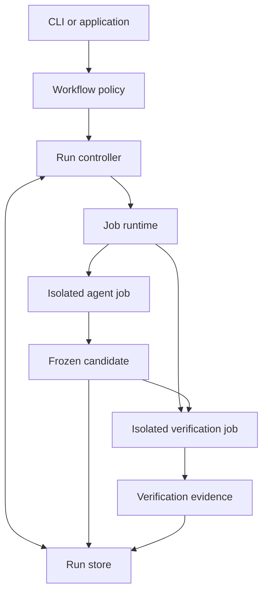

# Factory architecture

This document defines the intended core of the agent software factory.
It describes a design to implement. The repository contains the build scaffold and an initial reconciliation library.
The library includes PostgreSQL and DynamoDB adapters. The factory application remains to be implemented.

The factory supports software development and agent-powered applications through a shared execution platform.
We will build the core ourselves, with no DriftlessAF dependency or compatibility requirement.
Reconciliation, explicit ownership, bounded retries, and durable evidence guide the design.

## Design goals

- Complete work against explicit acceptance criteria.
- Recover after controller failure without blindly repeating execution or external effects.
- Isolate agent jobs from factory control and from other jobs.
- Produce results that another person or system can inspect and verify.
- Support different workflows without embedding software-development policy in the execution platform.

Build a distributed factory around a Go reconciliation library and a durable coordination store.
Use PostgreSQL or DynamoDB for distributed coordination. The memory adapter
supports local development and explicitly ephemeral single-process consumers.
The modules below describe the eventual factory application, beyond that library milestone.
The controller and its in-process reconcilers use Go.
Other projects choose their languages when their requirements are clear.
Module responsibilities do not prescribe separate deployments or network protocols.

## Core modules

| Module | Responsibility | Interface outcome |
| --- | --- | --- |
| Entry point | Validate a request, submit work, inspect progress, request cancellation | Run identity and current result |
| Workflow policy | Define stages, acceptance criteria, allowed revisions, and authorized external effects | Next action or task outcome |
| Run controller | Reconcile requested state with observed jobs and stored results | Durable progress toward completion |
| Job runtime | Start, observe, cancel, and clean up isolated jobs | Execution status and captured outputs |
| Agent integration | Launch one agent and interpret its provider-specific protocol | Agent progress, usage where available, and proposed outputs |
| Run store | Preserve requests, state, job identities, candidates, and evidence | Recoverable records and artifact references |

The execution platform consists of the generic run control, job execution, and storage capabilities.
A reconciler implements workflow policy in Go and supplies the meaning of success for a particular application.
Reconcilers compile into the controller application. The first core does not load dynamic plugins or expose an external reconciler protocol.
The controller coordinates persistence, runtime execution, capabilities, and limits.
The coordination store enforces ownership of queue writes across controller instances.
Application state owners enforce their own revision checks, idempotency, or fencing.
Reconcilers choose actions through those controlled interfaces.

Workloads remain language-independent.
A job can run an agent, command, build, or test suite in any language supported by its execution environment.
Workloads do not import a Go library or link against the controller.
Software workflows own repository preparation, candidate changes, and code verification.
Other applications can define different outputs and acceptance checks.

The reconciliation library has the factory as its intended consumer.
Keep factory-specific modules private to that application.
Extract other shared packages when another application needs them.
Add interfaces at actual substitution or testing seams. Avoid wrappers that only forward calls.

## Requests, runs, and jobs

A request states the desired result, inputs, acceptance criteria, capabilities, and limits.
Snapshot the accepted request so later input changes cannot silently change an active run.
Pin repository revisions, execution images, agent configuration, and verification definitions where applicable.
References to secrets identify authorized capabilities. They do not contain secret values.

A run is one attempt to complete a request.
A run owns its jobs, progress, outputs, evidence, and final task outcome.
A job is one execution assigned to a worker.
One run can include an agent job followed by a verification job.
A job retry receives a new identity and preserves the previous job record.
An explicit new attempt after run completion creates a new run.

Keep lifecycle, execution status, and task outcome separate:

| Record | Examples | Meaning |
| --- | --- | --- |
| Run lifecycle | Preparing, executing, verifying, finished | Current workflow stage |
| Job status | Requested, active, exited, lost | Observed execution state |
| Task outcome | Passed, failed, blocked, inconclusive, cancelled | Whether the request met its acceptance criteria |

The examples describe concepts, not a final wire schema.
A zero process exit does not establish task success.
A verifier infrastructure failure does not establish that a candidate is incorrect.
Missing evidence cannot produce a passed outcome.

## Reconciliation and ownership

Each reconciliation reads the request, stored progress, and current execution state.
It chooses the next necessary action and records its result.
Repeated reconciliation with unchanged observations must not create duplicate jobs or external effects.

Separate decision logic from effects so tests can exercise decisions without launching jobs.
Keep execution mechanics inside the runtime and persistence mechanics inside the store.
Start with polling for due work in the coordination store.
Events and queues can later wake the same reconciliation logic.
A wake-up is a reason to inspect current state, not an instruction to repeat an operation.

Persist the job identity and launch intent before execution starts.
The runtime must start or recover execution under that stable identity.
After a crash, the controller observes the existing execution before considering replacement.
If ownership or completion is uncertain, reconcile or report that uncertainty. Do not assume the job never started.

Use durable claims and fencing across controller instances.
The store atomically claims due work and rejects commits from completed or superseded claims.
Consuming services persist observations before completing queue work.
Deliver application changes through an outbox, recoverable change stream, or resync.
Enqueues that arrive during reconciliation must survive the current call's completion.
Claims do not prove that former owners stopped executing.
External effects need their own stable identities, idempotency, or fencing.
A queue alone does not provide these guarantees.

Distinguish waiting, infrastructure retries, and new agent attempts.
Waiting for a running job does not consume an agent attempt.
Enforce deadlines, retry limits, and available cost limits across recovery.
Do not reset budgets when the controller restarts.
If a provider cannot enforce a requested limit, expose that limitation before execution.

## Launch recovery design

A controller can crash after execution starts but before it saves the runtime handle.
Compare these designs for that uncertain transition:

| Design | Recovery behavior | Trade-off |
| --- | --- | --- |
| Detached child process with a recorded PID | A crash before PID persistence loses the lookup handle | Small launch interface, but requires additional supervision and identity checks |
| Runtime execution identified by a durable job key | The controller looks up existing execution by the recorded job identity | Requires runtime lookup, unique creation, and retained completion records |

Use runtime-managed execution with stable job identity for the first implementation.
A PID alone can be reused and does not identify a job across host restarts.
If a process supervisor provides durable identity and observation, it can satisfy the same runtime contract.
The choice does not require containers in every future implementation.

The caller asks the runtime to ensure execution exists for a job identity and immutable specification.
The runtime returns an observed handle and status, or explicit uncertainty.
It must reject reuse of that identity with a different specification.
Callers do not implement check-then-launch logic themselves.

The future runtime owns lookup and creation races.
Controller ownership alone does not fence surviving launch helpers.
Before accepting an adapter, define cancellation ordering and prove that confirmed stop prevents later launch.
Deadline enforcement while a controller is absent also belongs to that adapter.
The core library does not select supervision or deadline mechanisms.
Unique creation must prevent two executions for the same active identity.
After lookup, validate ownership and the specification before adopting execution.
A matching display name alone does not prove ownership.
Keep completion records until the controller durably records the result.
An absent execution after cleanup must not trigger another launch of a completed job.
Use a new job identity for an authorized retry.

For a named-container implementation, inspect and unique creation can support this contract.
A name conflict requires inspection and validation, not replacement of the existing container.
Separate creation from start so a crash between those operations remains observable.
Recover a created execution by starting it only when its stored state permits that transition.
Never restart an exited execution as though it had never run.

Before accepting a runtime, exercise the contract through its public interface.
Interrupt the controller before creation, after creation, and after start but before handle persistence.
Check ownership, conflicting specifications, terminal state retention, and cancellation in addition to duplicate launch prevention.
A single successful recovery experiment does not establish all of these guarantees.

## Software workflow

The first workflow produces a reviewable change from a repository and task:

1. Validate the task, immutable repository revision, execution policy, and acceptance checks.
2. Prepare an isolated workspace and record the baseline verification result where applicable.
3. Execute one agent job within the approved capabilities and limits.
4. Stop candidate mutation and freeze the proposed change.
5. Prepare a fresh verification workspace from that exact candidate.
6. Execute the acceptance checks and capture their observable results.
7. Record the task outcome and preserve the candidate and evidence.
8. Clean up owned execution resources without deleting retained evidence.

A baseline may include the known failure that the task asks the agent to fix.
Distinguish that failure from a broken environment or unrelated failures.

Capture added, changed, and deleted files, including relevant untracked files.
Record the base revision and content identity of the complete candidate.
Do not rely on a tracked-file diff alone.
Bind verification evidence to the candidate identity and execution configuration.
Changing the candidate invalidates its earlier verification result.

Acceptance checks belong to the task policy.
Distinguish owner-supplied checks from tests or check scripts that the agent changes.
Passing an edited test suite alone does not establish acceptance.
Run repository code and verification commands inside isolated jobs, including setup scripts.

Agent self-reports and independent model reviews provide supporting evidence.
The workflow determines acceptance from the required checks and observations.
See [project verification](adding-a-project.md#4-add-behavior-checks) for interface-level proof requirements.

## Execution isolation and capabilities

Treat repository content, agent outputs, and verification code as untrusted inputs.
The controller owns authority to execute and publish. Agent-authored text cannot grant that authority.
Validate and safely collect outputs before the controller consumes them.
Reject artifact paths that escape the owned workspace, including through symlinks.

Each job receives explicit filesystem access, network access, credentials, and resource limits.
Enforce these through the runtime rather than prompt instructions.
Keep controller state, production credentials, and runtime control sockets outside jobs.
Give each concurrent job separate mutable files, process state, ports, and data.
A Git worktree provides file separation, not execution isolation.

Choose the concrete sandbox runtime before executing arbitrary repositories.
The first runtime must document its threat model and demonstrate its enforced limits.
Keep provider credentials narrowly scoped. Prefer mediated access where the integration supports it.

Publishing a branch, opening a PR, merging, and deploying are separate authorized effects.
Recheck current authorization and external state before publication.
Use stable effect identities and recovery checks to prevent duplicate publication after retries.
The first software workflow should return a candidate and evidence before adding publication.

## Durable state and evidence

Use a deployment-specific coordination store behind the core's operation-based interface.
The library includes [PostgreSQL](../packages/reconcile/datastore/postgres/README.md) and [DynamoDB](../packages/reconcile/datastore/dynamodb/README.md) adapters.
Cloudflare native services remain candidates, subject to contract tests and consistency checks.
The memory adapter has no persistence or cross-process ownership.
The queue store owns due-work discovery, claims, diagnostics, and fenced queue completion.
Consuming services own desired state and observations. See [the ownership decision](adr/0004-key-based-reconciler-queue.md).
Artifact storage is a separate capability and can use deployment-native object storage.
Keep artifact contents immutable after capture and refer to them by stable content identities.
Commit terminal results only after their referenced artifacts are durable.
Logs describe activity; structured run state remains authoritative.
A full event-sourcing system is not required.

Retain the accepted request, job identities, runtime handles, execution configuration, and observed outcomes.
Evidence includes commands, exit codes, relevant logs, candidate identity, and verification observations.
Redact secrets before retention. Define retention and deletion policy with the storage implementation.

Persist cancellation intent before stopping execution.
Confirm that owned processes stop, then record the outcome and remaining cleanup work.
Cleanup must be repeatable and limited to owned resources.
An interrupted cleanup remains recoverable work, even after the task outcome is known.

Controller recovery requires durable coordination state.
Host-loss recovery for workloads also requires recoverable execution infrastructure.
Datastore durability alone cannot recover a lost workload or its uncaptured output.

## First milestone and verification

See the [durable reconciliation core design](design/core.md) for implemented interfaces, ownership, and acceptance tests.

The first slice implements the Go library, an ephemeral memory adapter, and shared adapter contract tests.
It covers coalesced enqueue, claim exclusion, fencing, retained notifications, delayed scheduling, retries, and cooperative shutdown.
The PostgreSQL adapter passes integration tests for controller interruption and unclean database restart.
The DynamoDB adapter runs shared contract, concurrent ownership, and response-failure tests against DynamoDB Local.
These emulator tests do not establish live AWS availability or consistency behavior.
These tests do not establish power-loss or replication-failover guarantees.
Evaluate native adapters for other deployment targets against the shared store contract.

Workload runtimes, agent integration, persistent artifacts, and a factory CLI remain later application work.
Their integration must prove execution recovery, cancellation, budget retention, candidate verification, and evidence durability.
A working reconciliation loop alone does not establish them.

Add notifications, remote workers, providers, and publication when concrete workflows require them.
Keep deployment topology and languages for other projects open until their requirements exist.
